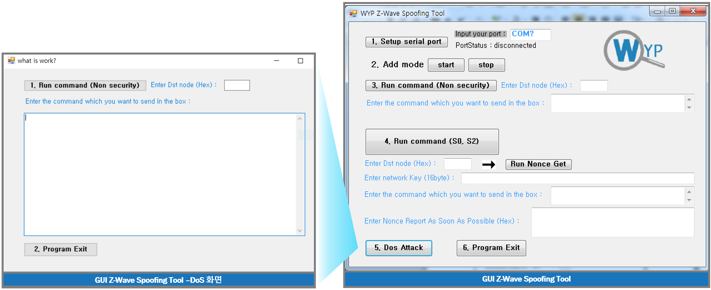
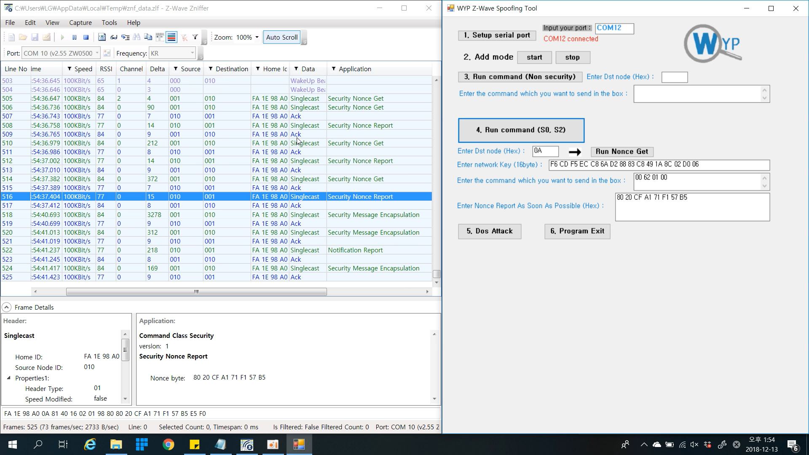

# WYP Z-Wave Spoofing Tool (GUI version)

## Features

- WYP Spoofing Tool is 100% managed code.
- 1. It can send Non-security packet.
- 2. It is adjusted S0 security mode. So, We can automatically send security packet.
- 3. It can also send packet in S2 security. If you know network key.

## Working WYP Z-Wave Spoofing Tool

- First, connect the ACC-UZB3-H-BRG to your computer and check the COM number in Device Manager.
- Enter the COM number that you checked in Input your port and click 1 to connect to the system.
- (In Non-security) For Non Security Frame, enter the Destination Node ID in hex and enter Application Data. By clicking Run Commnand, the attacker was able to control the Non Security product as desired.
- (In S0, S2 security mode) Enter the Destination Node ID and enter the Network Key to be used for encryption. Then, enter the data to encrypt and click Run Nonce Get to request Nonce. After receiving the Nonce value using Zniffer, enter the corresponding Nonce Data and click Run Command, the pre-set data is encrypted and sent to Node.

## Z-Wave DoS (Denial of Service)
To perform a DOS Attack, you can send long data after 0x98 40. When using the WYP tool, click 5.Dos Attack, enter the Node ID and Application Data, and click 1. Run Command to continuously split the frame and send the data. When sending DoS Attack to the Controller, it was confirmed that data was not sent and received.

